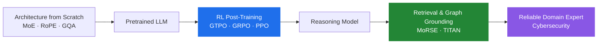

<div align="center">

# Marco Simoni

**Ph.D. in Artificial Intelligence — Sapienza University of Rome**

*Reinforcement Learning for LLM post-training · Foundation Models · AI for Cybersecurity*

<a href="https://winstonsmith1897.github.io/"></a>
<a href="https://scholar.google.com/citations?user=hhNQwfkAAAAJ"></a>
<a href="https://www.linkedin.com/in/marcosimoniai/"></a>
<a href="https://x.com/MarcoSimon21078"></a>
<a href="https://medium.com/@marco.simoni0711"></a>
<a href="mailto:marco.simoni0711@gmail.com"></a>

<br>


**[Research](#-research-focus)** · **[Projects](#-selected-projects)** · **[Publications](#-publications)** · **[Writing](#-technical-writing)** · **[Contact](#-contact)**

</div>

---

## 👋 About

I work on **making language models reason reliably** — from the optimization algorithms that train them to the architectures that run them.

My Ph.D. research (Sapienza University of Rome, in collaboration with **CNR-IIT**) focused on reinforcement learning for LLM post-training and on adapting foundation models to high-stakes domains, primarily cybersecurity. I design policy optimization methods that stay stable without a reference model, build LLM architectures from scratch, and ship retrieval and graph-reasoning systems that outperform frontier models on domain-specific tasks.

Reproducible code, honest baselines, benchmarks that measure what they claim to measure.

> [!NOTE]
> **Currently working on:** objective bias in group-based RL · KL-free policy optimization · efficient inference for reasoning models.
> Open to research collaborations — [get in touch](mailto:marco.simoni0711@gmail.com).

---

## 🔬 Research Focus



| Area | What I do |
|:--|:--|
| **RL for LLM Alignment** | Policy optimization (PPO, GRPO, GTPO) for reasoning. Diagnosing and fixing gradient conflict, entropy collapse, and hidden objective biases in group-relative methods. |
| **LLM Architecture & Efficiency** | Transformer design from first principles: Sparse MoE, RoPE, GQA, sliding-window attention, static KV caching. Throughput and memory as first-class constraints. |
| **Retrieval & Graph Reasoning** | Multi-retriever RAG and executable reasoning over knowledge graphs, for domains where hallucination is unacceptable. |
| **AI for Cybersecurity** | Foundation models for attack prediction, LLM-driven vulnerability detection, KG modeling of Cyber Threat Intelligence (MITRE ATT&CK, CAPEC, MBC, CVE). |

---

## 🚀 Selected Projects

<table>
<tr>
<td width="50%" valign="top">

<a href="https://github.com/winstonsmith1897/GTPO">
  
</a>

</td>
<td width="50%" valign="top">

<a href="https://github.com/Mixture-of-RAGs-Security-Experts/MoRSE">
  
</a>

</td>
</tr>
<tr>
<td width="50%" valign="top">

<a href="https://github.com/cti-graph-reasoner/TITAN">
  
</a>

</td>
<td width="50%" valign="top">

<a href="https://github.com/winstonsmith1897/DantinoX">
  
</a>

</td>
</tr>
</table>

### [GTPO — Group-relative Trajectory-based Policy Optimization](https://github.com/winstonsmith1897/GTPO)

[](https://arxiv.org/abs/2508.03772)
[](https://arxiv.org/abs/2508.03772)
[](https://github.com/winstonsmith1897/GTPO/stargazers)

A **KL-free** policy optimization algorithm for LLM post-training. GTPO identifies *conflict tokens* — tokens appearing at the same position across completions with opposite rewards — and protects them by skipping negative updates while amplifying positive ones. It additionally filters completions whose entropy exceeds a provable threshold, preventing policy collapse **without a reference model**.

| Property | GRPO | GTPO |
|:--|:--|:--|
| Reference model required | Yes (KL term) | ✅ **No** |
| Gradient conflict handling | ❌ None | ✅ Conflict masking |
| Entropy control | Implicit via KL | ✅ Provable threshold filter |
| Reasoning gain (OOD: AIME'24/'25, AMC) | baseline | 📈 **up to +15%** |

Evaluated on GSM8K, MATH and AIME2024, GTPO consistently outperforms both GRPO and SFT across settings.

<details>
<summary>📖 <b>BibTeX</b></summary>

```bibtex
@article{simoni2026gtpo,
  title   = {GTPO: Stabilizing Group Relative Policy Optimization
             via Gradient and Entropy Control},
  author  = {Simoni, Marco and Fontana, Aleksandar and Rossolini, Giulio
             and Saracino, Andrea and Mori, Paolo},
  journal = {Transactions of the Association for Computational Linguistics},
  year    = {2026},
  url     = {https://arxiv.org/abs/2508.03772}
}
```

</details>

---

### [MoRSE — Mixture of RAG Security Experts](https://github.com/Mixture-of-RAGs-Security-Experts/MoRSE)

[](https://dl.acm.org/doi/10.1145/3672608.3707898)
[](https://arxiv.org/abs/2407.15748)
[](https://github.com/Mixture-of-RAGs-Security-Experts/MoRSE/stargazers)

The first specialized RAG assistant for cybersecurity: a dual-cascaded framework with **7 parallel retrievers**, each specialized on a distinct knowledge source (MITRE, CVE, Metasploit, ExploitDB). Knowledge bases refresh in real time — no retraining required.

> **Result:** +15% response accuracy over GPT-4 on general and multi-hop cybersecurity questions.

---

### [TITAN — Graph-Executable Reasoning for Cyber Threat Intelligence](https://github.com/cti-graph-reasoner/TITAN)

[](https://arxiv.org/abs/2510.14670)
[](https://github.com/cti-graph-reasoner/TITAN/stargazers)

Bridges natural-language threat queries and executable reasoning over a structured knowledge graph. An LLM **path planner** predicts relational paths and starting entities; a **graph executor** traverses them over a modified MITRE knowledge graph to retrieve the answer set.

> **Released with the TITAN Dataset:** 88,209 examples (74,258 train / 13,951 test) pairing questions with executable reasoning paths and step-by-step Chain-of-Thought explanations.

---

### [DantinoX — LLM from Scratch in JAX/Flax](https://github.com/winstonsmith1897/DantinoX)

[](https://github.com/winstonsmith1897/DantinoX)
[](https://github.com/winstonsmith1897/DantinoX/stargazers)

A full LLM architecture implemented from first principles: **Sparse Mixture-of-Experts, RoPE, attention gating, GQA**. Hardware throughput maximized via sliding-window attention, static KV caching and gradient checkpointing — built to make every architectural trade-off explicit and measurable.

---

## 📚 Publications

<div align="center">

**215 citations · h-index 6 · i10-index 4** — [full list on Google Scholar](https://scholar.google.com/citations?user=hhNQwfkAAAAJ)

</div>

### 2026

- **GTPO: Stabilizing Group Relative Policy Optimization via Gradient and Entropy Control**
  **M. Simoni**, A. Fontana, G. Rossolini, A. Saracino, P. Mori — *TACL* [](https://arxiv.org/abs/2508.03772) [](https://github.com/winstonsmith1897/GTPO)
- **On the Hidden Objective Biases of Group-based Reinforcement Learning**
  A. Fontana, **M. Simoni**, G. Rossolini, P. Mori, A. Saracino — *ACL 2026*
- **Concise Thoughts: Impact of Output Length on LLM Reasoning and Cost**
  S. Nayab, G. Rossolini, **M. Simoni**, A. Saracino, G. Buttazzo, et al. — *Information Sciences* &nbsp;`123 citations`
- **Toward Reliable and Adaptive Large Language Models in the Cybersecurity Domain**
  **M. Simoni** — *Ph.D. Thesis, Sapienza University of Rome*

### 2025

- **TITAN: Graph-Executable Reasoning for Cyber Threat Intelligence**
  **M. Simoni**, A. Fontana, A. Saracino, P. Mori [](https://arxiv.org/abs/2510.14670)
- **Improving LLM Reasoning for Vulnerability Detection via Group Relative Policy Optimization**
  **M. Simoni**\*, A. Fontana\*, G. Rossolini, A. Saracino [](https://arxiv.org/abs/2507.03051)
- **MoRSE: Bridging the Gap in Cybersecurity Expertise with Retrieval Augmented Generation**
  **M. Simoni**, A. Saracino, V. P., M. Conti — *ACM/SIGAPP SAC 2025*, 1213–1222 &nbsp;`33 citations`

<details>
<summary><b>Show all publications</b> (2025 and earlier)</summary>

<br>

- **KGQuest: Template-Driven QA Generation from Knowledge Graphs with LLM-Based Refinement**
  S. Nayab, **M. Simoni**, G. Rossolini, A. Saracino — [arXiv:2511.11258](https://arxiv.org/abs/2511.11258), 2025
- **On-Device Derivation of IoT Usage Control Policies: Automating U-XACML Policy Generation from Natural Language with LLMs in Smart Homes Environments**
  L. Alajramy, **M. Simoni**, M. Rasori, A. Saracino, P. Mori — *Future Generation Computer Systems*, 2025
- **Leveraging Knowledge Graphs and LLMs for Structured Generation of Misinformation**
  S. Nayab, **M. Simoni**, G. Rossolini — *ARES 2025*, 334–350
- **Unmasking Model Behavior: How LLMs Reason on Vulnerability Detection**
  A. Fontana, **M. Simoni** — *ARES 2025*, 316–333
- **MATRIX: A Comprehensive Graph-Based Framework for Malware Analysis and Threat Research**
  **M. Simoni**, A. Saracino — *SECRYPT 2025*
- **Cybersecurity with LLMs and RAGs: Challenges and Innovations**
  **M. Simoni**, A. Saracino — *SecureComm 2024*
- **Graph-Based Android Malware Detection and Categorization through BERT Transformer**
  **M. Simoni**, A. Saracino — *ARES 2023* &nbsp;`19 citations`

</details>

<sub>\* Equal contribution.</sub>

---

## 🏛️ Research Experience

**CNR-IIT & NetGroup** — *AI Researcher*
Engineered an LLM-driven framework automating the translation of natural-language requirements into structured XACML / U-XACML access control policies, deployable on-device for IoT and smart-home environments.

**Horus Project** — *AI Researcher*
Architected and trained a Transformer-based foundation model from scratch for proactive cyber-attack prediction.

---

## ✍️ Technical Writing

- [**GTPO vs GRPO: A Smarter Path to Stable Reasoning LLMs**](https://medium.com/@marco.simoni0711/gtpo-vs-grpo-a-smarter-path-to-stable-reasoning-llms-3f51bc0b58c1) — how conflict masks and entropy regularization address GRPO's gradient conflicts and policy collapse.
- [**REINFORCE vs. Posterior Token Targets: Two Paths to Steering Language Models**](https://medium.com/@marco.simoni0711/reinforce-vs-posterior-token-targets-two-paths-to-steering-language-models-42892f15cd70) — the core mechanics of reshaping per-step token probabilities to steer model behavior.

---

## 🛠️ Stack

<div align="center">


</div>

<div align="center">

`TRL` &nbsp;·&nbsp; `Unsloth` &nbsp;·&nbsp; `NetworkX` &nbsp;·&nbsp; `MITRE ATT&CK` &nbsp;·&nbsp; `CAPEC` &nbsp;·&nbsp; `MBC` &nbsp;·&nbsp; `Metasploit` &nbsp;·&nbsp; `pwndbg`

</div>

---

## 📊 GitHub

<div align="center">


</div>

---

<div align="center">

### 📮 Contact

Open to research collaborations on **RL for post-training**, **reasoning**, and **trustworthy LLMs**.

[marco.simoni0711@gmail.com](mailto:marco.simoni0711@gmail.com)

<sub>⭐ If any of this work is useful to you, a star on the repos helps others find it.</sub>

</div>
